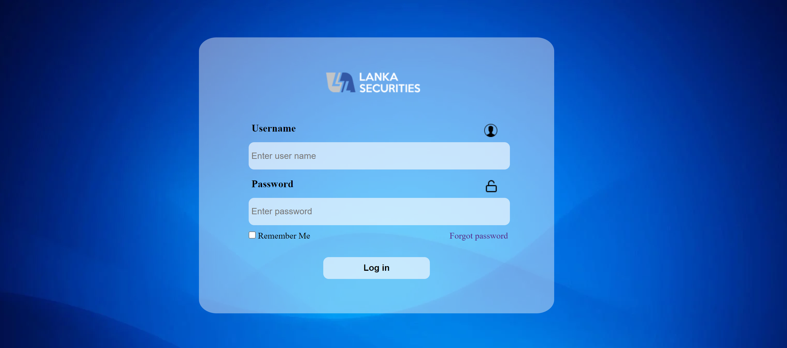
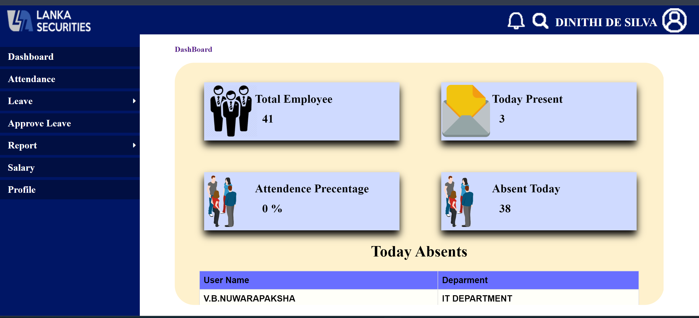
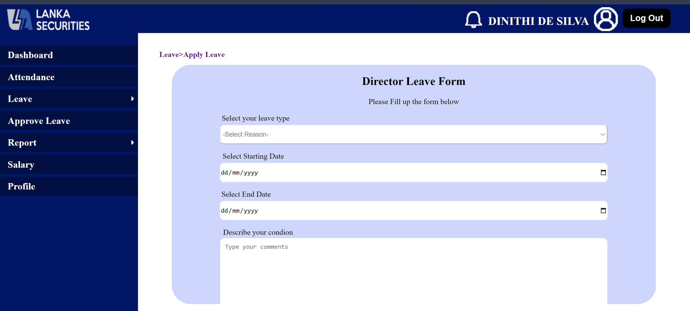

# 📝 Leave Management and Salary Calculation System

This project is a comprehensive system designed to streamline the processes of leave management and salary calculation for organizations. It provides an easy-to-use interface for both employees and administrators, making it simpler to handle leave requests, monitor leave balances, and calculate salaries accurately based on various factors such as leaves taken, hours worked, and employee category.

## 📋 Table of Contents

- [⭐ Features](#-features)
- [📸 Screenshots](#-screenshots)
- [💻 Technologies Used](#-technologies-used)
- [⚙️ Installation](#%EF%B8%8F-installation)
- [🚀 Usage](#-usage)
- [🤝 Contributing](#-contributing)
- [📄 License](#-license)

## ⭐ Features

- **Employee Management**
  - Add, edit, and delete employee records
  - Manage personal details, designation, and salary information
- **Leave Management**
  - Employees can request leaves and view their leave balance
  - Administrators can approve or deny leave requests
- **Salary Calculation**
  - Calculates salaries based on leave taken, overtime, and deductions
  - Supports different payroll rules for employee categories
- **Role-Based Access Control**
  - Provides separate access levels for employees and administrators
  - Ensures secure data handling based on roles
- **Reports**
  - Generate attendance and leave reports
  - View detailed salary breakdowns

## 📸 Screenshots

Here are some screenshots of the Leave Management and Salary Calculation System:

### Login Page


### Employee Dashboard


### Leave Request Form


## 💻 Technologies Used

- **Frontend**
  - HTML
  - CSS
  - JavaScript
- **Backend**
  - PHP
- **Database**
  - MySQL
- **Other Tools**
  - Bootstrap
  - AJAX
  - jQuery

## ⚙️ Installation

To run this project locally, follow these steps:

1. **Clone the repository**:
   ```bash
   git clone https://github.com/sunhesh12/LeaveManagementAndSalaryCalculationSystem.git
   ```
   
2. **Set up the database**:
   - Import the SQL file located in the `database` folder into your MySQL server.
   - Update the database configuration details in the `config.php` file to match your MySQL credentials.

3. **Run the project**:
   - Start a local server (using XAMPP, WAMP, or similar).
   - Place the project folder in the server's root directory.
   - Access the project in a web browser by navigating to `http://localhost/LeaveManagementAndSalaryCalculationSystem`.

## 🚀 Usage

1. **Administrator**:
   - Log in with administrator credentials.
   - Manage employee records, view and approve leave requests, and manage payroll details.
   
2. **Employee**:
   - Log in with employee credentials.
   - Submit leave requests, view leave balance, and check payroll information.

## 🤝 Contributing

If you'd like to contribute to this project:

1. Fork the repository.
2. Create a new branch for your feature or bug fix.
3. Make your changes and commit them with descriptive messages.
4. Push your changes to your fork.
5. Submit a pull request, explaining your changes.

## 📄 License

This project does not currently include a license. If you plan to use or distribute this project, please contact the repository owner for permissions and guidelines.
